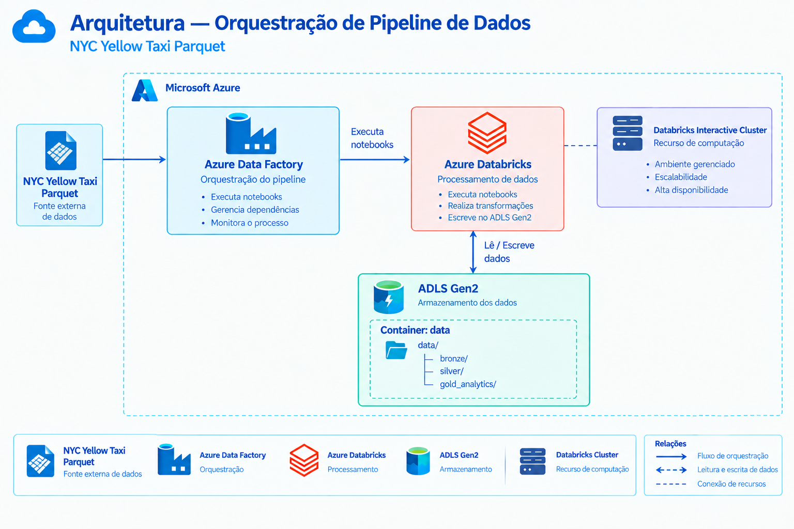
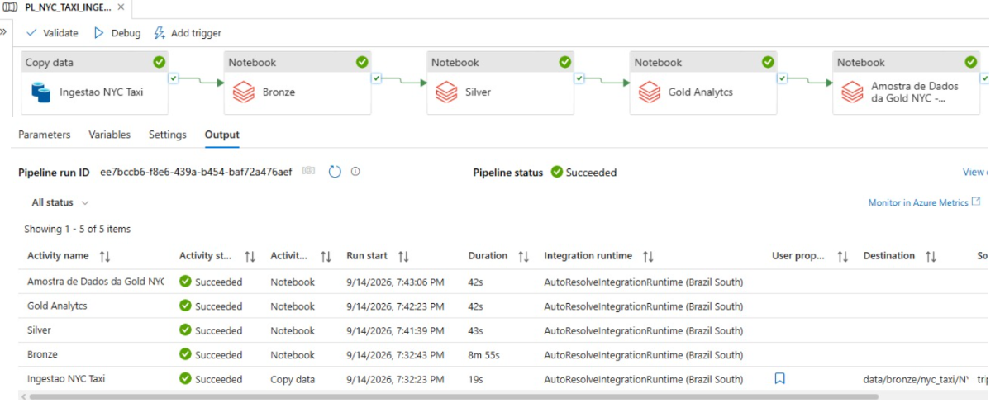
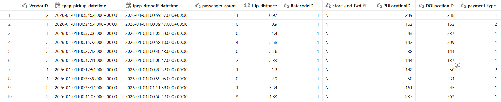

# Orquestração de Pipeline de Dados - NYC Yellow Taxi

## 1. 🎯 Problema

O dataset NYC Yellow Taxi apresentava **inconsistências nos dados**, como campos de data que precisavam de tratamento e valores nulos em diferentes colunas, exigindo uma etapa de análise e tratamento antes do consumo dos dados.

---

## 2.💡 Solução

Foi desenvolvido um **pipeline de dados ponta a ponta, utilizando ADF(Azure Data Factory)** para **orquestração** e **Azure Databricks** para **processamento**, seguindo a **Arquitetura Medallion.**

O Data Profiling realizado na camada Bronze orientou o tratamento das inconsistências na Silver, enquanto a Gold foi utilizada para persistir os dados processados. 

Ao final da execução, um notebook de **Amostra apresenta 10 registros do resultado do pipeline**, permitindo validar sua saída.

---

## 3. 📊 Data Profiling

Durante o **Data Profiling**, foram identificadas as principais características da fonte:

* 3.724.889 registros
* 20 colunas
* 1.088.058 registros (29,2%) contendo valores nulos simultaneamente nos cinco campos analisados
* Nenhuma duplicidade de registro completo
* Identificação dos tipos de dados e distribuição das principais variáveis

---

## 4. 🏗️ Arquitetura

A arquitetura utiliza o **Azure Data Factory** como camada de **orquestração**, o **Azure Databricks** para processamento e o **ADLS Gen2** para armazenamento dos dados.

---

## 5. 🔄 Fluxo do Projeto

O **Azure Data Factory coordena automaticamente** a execução das etapas de **ingestão**, **processamento** e **validação dos dados**.

---

## 6. 🔧 Transformações

As transformações foram definidas a partir das descobertas realizadas no **Data Profiling**.

Os campos **`tpep_pickup_datetime`** e **`tpep_dropoff_datetime`** foram convertidos para **`timestamp`**.

A exibição desses campos no Databricks apresenta o offset **`+00:00`**, referente ao **UTC**. 

Esse comportamento é esperado e não representa sujeira ou alteração indevida dos dados. 

O tipo **`timestamp`** preserva o uso correto das informações temporais.

Após a identificação dos **valores nulos, foi realizada uma análise da distribuição dos dados**, considerando frequência **moda e mediana**. 

Com base nessa análise, foram definidos os valores de imputação buscando preservar, sempre que possível, a distribuição observada e evitar distorções no conjunto de dados.

| Campo                  |  Imputação | Critério observado |
| ---------------------- | ---------: | ------------------ |
| `passenger_count`      |   NULL → 1 | Moda               |
| `RatecodeID`           |   NULL → 1 | Moda               |
| `store_and_fwd_flag`   |   NULL → N | Moda               |
| `congestion_surcharge` | NULL → 2.5 | Moda / mediana     |
| `Airport_fee`          |   NULL → 0 | Moda / mediana     |

---

## 7. 🛠️ Tecnologias Utilizadas

* Azure Data Factory
* Azure Databricks
* ADLS Gen2
* PySpark
* Spark SQL
* Parquet
* Unity Catalog
* Databricks Interactive Cluster

---

## 8. 📈 Amostra dos Resultados

A etapa **final do pipeline valida a leitura  por meio do notebook** `Amostra de Dados da Gold NYC - Pipeline`**, apresentando uma amostra dos dados e informações de volume, registros distintos, quantidade de colunas e schema.

**Notebook:** `NYC-TAXI-OQUESTRACAO/Amostra de Dados da Gold NYC - Pipeline`

## Autor
* Genivon Silva
* Data Engineer
* GitHub: https://github.com/jhenivon/
* LinkedIn: https://www.linkedin.com/in/genivon-silva-69bb9b9b/
